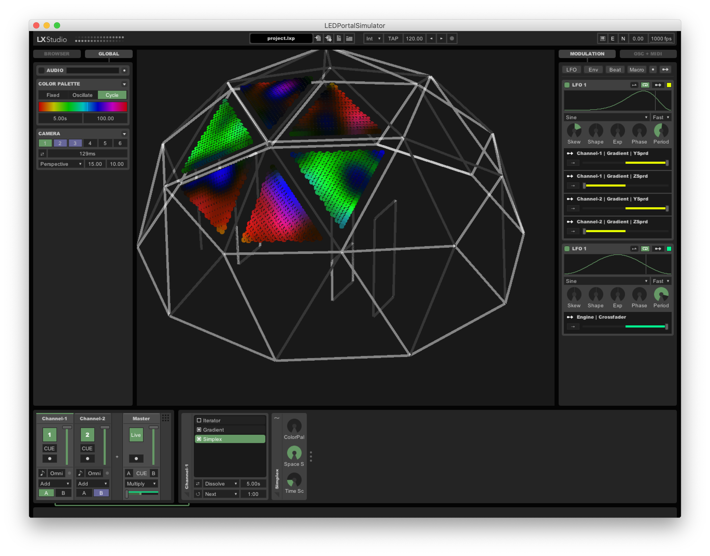

# LEDPortalSimulator
LXStudio Simulator and animations for Flavius' LED Art Installation

> :warning: **This repo has been rebased onto [LXStudio-IDE](https://github.com/heronarts/LXStudio-IDE) and is deprecated by [this repo](github.com/flavius-space/ledportal-ide)**: I'm not a huge fan of the Processing editor, and have opted to continue development in a proper Java IDE. I won't be working on this repo any further, and have added a bunch of awesome new features to the [The IDE Version](github.com/flavius-space/ledportal-ide) of the repo, however the build instructions are not quite up to scratch, so if you're a Java wizard and know how to get classpaths working, I would recommend trying out the IDE version, but until then, this older repo is the easier way to get things working.



## Repo Structure

- **LEDPortalSimulator** - a Processing sketch which wraps around
  [LXStudio](https://github.com/heronarts/LXStudio) to control how patterns are sent to the LEDs
  - **code** - compiled library files
  - **data** - LED / stucture layout and config definitions, assets used in animations
  - **LEDPortalSimulator.pde** - Start here
  - **Pattern_\*.pde** - LED Pattern definitions. Contribute animations using this convention
  - **UI.pde** - Components to extend the LXStudio UI
  - **Model.pde** - Keeps track of pixel positions
  - **project.lxp** - LXStudio project state file
- **tools** - Python utility scripts that mostly interface with Blender
  - **light_layout.py** - Generates a set of lights for all selected polygons in the currently
  selected mesh group. Outputs lights to JSON for easy import. Optionally places lights in the
  Blender scene for previewing.
  - **export_structure.py** - Converts the selected Blender mesh into JSON format, so that it can
  be displayed along with the LEDs in LXStudio
- **tests** - Tests for Python Utilities

## LED Portal Simulator Processing Sketch

### Prerequisites

- Install [Processing](https://processing.org/)
- Install Processing Video library: ** Sketch → Import Library → Add Library... **

### Usage

Open `LEDPortalSimulator` in Processing

on macos:

```bash
open -a Processing LEDPortalSimulator/LEDPortalSimulator.pde
```

if u want steamed hams, just open (cmd-O) the  `LEDPortalSimulator/presets/movieFrame.lxp` preset.


## Python Utility Scripts (`tools`)

### Setup

If you are using VSCode, it's helpful to point your editor to use the Python included in Blender.
Determine your blender Python location, and add it to your `.vscode/settings.json`

```json
{
  ...
  "python.pythonPath": "/Applications/Blender.app/Contents/Resources/2.80/python/bin/python3.7m"
}
```

To run the scripts on your model file, you will need to install the script's dependencies into
Blender's internal Python environment.

```bash
/Applications/Blender.app/Contents/Resources/2.80/python/bin/python3.7m -m pip install -r tools/requirements.txt
```

Modify the file `script_wrapper.py` so that `REPO_DIR` points to the absolute path of the `tools`
folder of this repo and `things_to_run` points to the Python modules you want to run.

### Usage

Open your Blender file containing your LED model from a terminal. If blender was installed with
`brew cask` you will have access to a `blender` command, otherwise you can just call the full name
of the blender executable.

```bash
blender your_model.blend
```

Then, in the Scripting tab, open the file `script_wrapper.py` and click `Run Script`. The script
will output to the terminal from which Blender was initially run, as well as a log file in the root
of the repo.

Note: because of the weird way these files are imported in Blender, you need to reload the script
each time it is modified by an external program. It is recommended not to edit the file in Blender
because it's a pretty shitty IDE, and it won't save the changes back to the repo.
